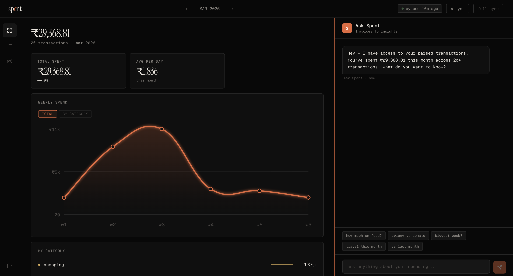

# spent

**Invoices to Insights.**

A personal finance agent — no bank logins, no SMS permissions, no manual entry. Just Invoices from your email.



---

## What it does

**spent** reads your Gmail inbox, parses every receipt and invoice it finds, and gives you a real-time picture of your spending — with a beautiful dashboard and a conversational agent that can answer any question about your own money.

---

## Features

### Gmail-powered sync
- Connects to your Gmail via read-only OAuth (no passwords stored)
- Automatically picks up receipts from Swiggy, Zomato, Amazon, Uber, Rapido, IndiGo, Cleartrip, and more
- Per-brand parsers for known senders; DeepSeek-V3.2 AI extraction for everything else
- All data stored locally in SQLite — nothing leaves your machine except the AI extraction call (and that's cached by email ID)

### Dashboard
- Monthly KPI tiles — total spend, transaction count, top category, top merchant, and month-over-month delta
- Interactive weekly spend line chart (total view or broken down by category)
- Click a category in the legend to highlight just that line
- Month switcher to browse historical months

### Ask Spent — conversational agent
- Chat interface powered by Grok with tool-use streaming
- Answers questions like:
  - *"Why is my Amazon spend high this month?"*
  - *"How much did I spend on food in March?"*
  - *"Compare this month vs last month"*
  - *"Top 5 merchants this month"*
- Agent automatically scopes to the month you're currently viewing if you don't specify one
- Shows every tool call it made and what it found — no black box
- Resizable chat pane (drag the divider)

### Sync controls
- Manual sync button with live SSE progress
- Stop button to abort mid-sync
- Full re-sync option (clears cache and re-extracts everything)

---

## How it works

```
Gmail Inbox
    │
    ▼
Gmail OAuth (read-only)
    │
    ▼
Email Router — matches sender domain to known parsers
    │
    ├── Brand parsers (Swiggy, Zomato, Amazon, Rapido, Uber, IndiGo, Cleartrip)
    │       regex-based, fast, free
    │
    └── Generic AI parser (DeepSeek-V3.2)
            for anything else — BookMyShow, Myntra, banks, etc.
            result cached in SQLite by email ID
    │
    ▼
Structured transactions in SQLite
    │
    ├── Dashboard API  →  pre-computed aggregates, charts
    │
    └── Agent API  →  Grok tool-use loop, streaming SSE
                      tools: query_transactions, search_gmail
```

---

## Tech stack

| Layer | Technology |
|---|---|
| Framework | SvelteKit (TypeScript) |
| Backend | SvelteKit server routes + Node.js |
| Database | SQLite via `better-sqlite3` |
| Gmail | Google OAuth2 + Gmail API (read-only) |
| AI — extraction | DeepSeek-V3.2 via Azure AI Foundry |
| AI — agent | Grok via Azure AI Foundry |
| Styling | Vanilla CSS, custom design tokens |
| Charts | Pure SVG (Catmull-Rom bezier) |
| Streaming | Server-Sent Events (SSE) |

---

## Setup

### 1. Prerequisites
- Node.js 18+
- A Google Cloud project with Gmail API enabled
- Azure AI Foundry access (DeepSeek-V3.2 + Grok deployments)

### 2. Install
```bash
npm install
```

### 3. Configure environment
Create a `.env` file:

```env
GOOGLE_CLIENT_ID=your_google_client_id
GOOGLE_CLIENT_SECRET=your_google_client_secret
GOOGLE_REDIRECT_URI=http://localhost:5173/api/auth/google/callback

AZURE_AI_ENDPOINT=https://your-endpoint.services.ai.azure.com
AZURE_AI_KEY=your_azure_key
DEEPSEEK_MODEL=DeepSeek-V3.2
GROK_MODEL=grok-4-fast-reasoning

DB_PATH=./data/spent.db
SESSION_SECRET=change_this_in_production
```

### 4. Migrate database
```bash
npm run db:migrate
```

### 5. Run
```bash
npm run dev
```

Open [http://localhost:5173](http://localhost:5173), sign in with Google, and hit **Sync**.

---

## Why Gmail?

Every personal finance app in India is fighting for transaction data — chasing Account Aggregator licensing, SMS read permissions (blocked on iOS), bank OAuth integrations. It takes months, costs money, hits regulatory walls.

Urban Indians already receive their entire financial life as email: Swiggy orders, Amazon invoices, Uber receipts, flight bookings, credit card statements. **That's 80–90% of discretionary spending, already structured, already in your inbox.**

Gmail OAuth is read-only, works natively on iOS, requires zero regulatory approval, and users already trust Google with this data.

---

## Privacy

- Gmail access is read-only and scoped to specific sender searches
- All transactions are stored locally in a SQLite file on your machine
- AI extraction calls send only the email body text to Azure AI Foundry (no metadata, no attachments beyond invoice PDFs)
- Extraction results are cached — each email is processed at most once
